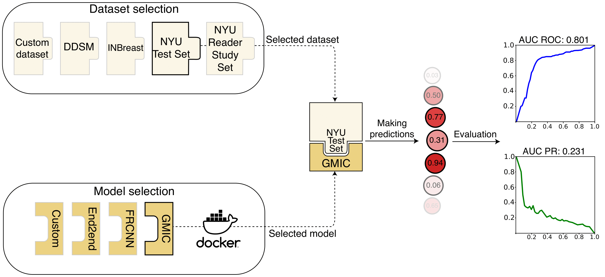

# Meta-repository of screening mammography classifiers
## Introduction
This metarepository is a project aimed to accelerate and standardize research and evaluation in deep learning for screening mammography. It includes ready-to-use Docker images of several screening mammography models. There are two main usecases for the metarepository:

1. Developers of deep learning models can provide their implementations in the form of Docker images. This enables fair comparison with other models on various datasets.
2. Data owners can evaluate multiple state-of-the-art models with very little user involvement and without the need to implement the models or their preprocessing pipelines.



## Prerequisites
 * Docker 19.03.6
 * [NVIDIA Container Toolkit](https://docs.nvidia.com/datacenter/cloud-native/container-toolkit/overview.html)
 * Python 3.6-3.8
    * Cython (0.29.21)
    * scikit-learn (0.24.1)
    * pandas (0.25.2)
    * matplotlib (3.3.3)

## Using the metarepository
### 1. Set up users
To avoid running the Docker container as root and avoid permission issues when accessing files inside the container, we create users and groups in the container that correspond to users and groups on the host machine. This is done with the `users.txt` file. It should include groupname and group_id and the usernames and user_ids of the people belonging to this group who are granted access to run the containers/models. 

#### Creating `users.txt`

You can create the file on your own or copy `template_users.txt` with `cp template_users.txt users.txt` and update the latter file. Structure:

```
group_name,group_id
user1,user1_id
user2,user2_id
...
```
Please note, that no spaces are used after commas.

*Simple setup: single user*

If you are a single user and it does not matter whether other users will have access to dockerized models, you can do the following.
First, use the command `id` in bash to get all the info you need:
```
jakub@jakub:~/mammography_metarepository$ id
  uid=1000(jakub) gid=1000(jakub) ...
```
You can use the above information to update the `users.txt` file:
```
jakub,1000
jakub,1000
```

*Access for multiple users*

If you would like for multiple users to run models, they need to belong to the same group. Let's assume that you have a group `group1` and four users: `user1`, `user2`, `user3`, `user4` (you can read more about groups and users [here](https://www.howtogeek.com/50787/add-a-user-to-a-group-or-second-group-on-linux/)).

You can check the id of your group by using `grep <group_name> /etc/group`
```
user1@server:~/mammography_metarepository$ grep group1 /etc/group
  group1:x:1234567890:user1,user2,user3,user4
```

You can check the id's of specific users with the `id <user_name>` command, for example:
```
user1@server:~/mammography_metarepository$ id user2
  1000000002
```

Use the above info to fill the `users.txt` in the following way:
```
group1,1234567890
user1,1000000001
user2,1000000002
user3,1000000003
user4,1000000004
```

When creating Dockerfiles for your own model, we suggest you take a similar approach to avoid running the container with root privileges.

### 2. Run model on sample data

In order to run a model with included sample data, you need to populate the `users.txt` file, and then run the `run.sh` bash script, providing basic arguments:

    bash run.sh <model_name> <experiment_name> <img_path> <prepr_img_path> <label_path> <result_path> <device> <gpu_number> <bootstrap_flag>

where the arguments represent:
* `model_name` - name of the model you want to evaluate. This is equivalent to a directory name in the `/models/` folder. As of now, available models are: `end2end`, `frcnn_cad`, `nyu_glam`, `nyu_gmic`, `nyu_model`, `nyu_model_single`
* `experiment_name` - name of the experiment; will be used to save results
* `img_path` - path to the directory with input images
* `prepr_img_path` - path to a directory where the preprocessed images created by the model/container will be stored
* `label_path` - path to a pickle (.pkl) that contains the labels, see below for details
* `result_path` - directory where the results (predictions and figures) should be saved
* `device` - either `gpu` or `cpu`. (Note: `frcnn_cad` model is GPU-only)
* `gpu_number` - which gpu to use, e.g. `0`, not required if `device==cpu`.
* `bootstrap_flag` - by default, your results will have 95% confidence intervals calculated for areas under curves. If you do _not_ want bootstrap to be calculated, set the value to `no_bootstrap`

An example command to run a NYU GMIC model on GPU:0 with the sample data included in this repository would look like the following:

    bash run.sh nyu_gmic experiment01 sample_data/images/ sample_data/preprocessed_images/ sample_data/data.pkl predictions/ gpu 0 no_bootstrap
  
### 3. Changing model parameters
Our models also include an optional configuration file, `config.txt`, which can be found in the model's directory, e.g. `/models/end2end/config.txt` is a configuration file for the end2end model: 

```bash
MEAN_PIXEL_INTENSITY=44.4
MODEL=inbreast_vgg16_[512-512-1024]x2_hybrid.h5
NUM_PROCESSES=10
PREPROCESS_FLAG=True
```

It is specific to the model and contains variables/parameters that can be changed. Please refer to README files in model subdirectories for model-specific details, e.g. `/models/end2end/README.md`.

## How do I use my own data set?
If you are in possession of a data set that you would like to use with the included models, please read the following. There are two parts of a data set that the metarepository expects: *images* and a *data list*.

### Images
*Images* must be saved in a PNG format and stored in a common directory. Models expect 16-bit PNGs. You can use a sample snippet to convert DICOM files to 16-bit PNGs as follows:

```python
import png
import pydicom
def save_dicom_image_as_png(dicom_filename, png_filename, bitdepth=12):
    """
    Save 12-bit mammogram from dicom as rescaled 16-bit png file.
    :param dicom_filename: path to input dicom file.
    :param png_filename: path to output png file.
    :param bitdepth: bit depth of the input image. Set it to 12 for 12-bit mammograms.
                     Set to 16 for 16-bit mammograms, etc.
                     Make sure you are using correct bitdepth!
    """
    image = pydicom.read_file(dicom_filename).pixel_array
    with open(png_filename, 'wb') as f:
        writer = png.Writer(
            height=image.shape[0],
            width=image.shape[1],
            bitdepth=bitdepth,
            greyscale=True
        )
        writer.write(f, image.tolist())
```

If you are converting DICOM images into PNGs, make sure that mammograms are correctly presented after conversion. If there are any VOI LUT functions or Photometric Interpretation conversions necessary, you need to make sure the PNG represents an image after applying those.

### Data list
The *data list* is a pickle file (e.g. data.pkl) containing information for each exam. More specifically, the data list is a pickled list of dictionaries, where each dictionary represents a screening mammography exam. The information in one of these dictionaries is shown below.

```python
{
  'L-CC': ['0_L_CC'],
  'R-CC': ['0_R_CC'],
  'L-MLO': ['0_L_MLO'],
  'R-MLO': ['0_R_MLO'],
  'cancer_label': {
    'left_malignant': 0, 
    'right_malignant': 0, 
  },
  'horizontal_flip': 'NO',
}
```
* `L-CC`, `R-CC`, `L-MLO`, and `R-MLO` specify the images for each view in the exam. Values of those keys specify file names of the images, e.g. `0_L_CC` means that the model will look for a `0_L_CC.png` file.
* `cancer_label` contains labels for each breast in the exam indicating whether a malignant lesion is present or not (breast-level)
* `horizontal_flip` is used if the model expects all of the images to be facing a certain way. Note that not all of this information is required for all of the models.

**Most importantly, please review the `sample_data` directory. It contains a very simple dataset -- if you follow the convention of the file formats, you should be able to easily convert your dataset to match the requisite format.**

## How do I add my own model?

We strongly encourage contributions and feedback from other research groups. If you want to contribute a model, we ask that you follow these guidelines.

There are three things you should include:
  * Dockerfile - this creates an image that has the environment required to run your model. This should clone any repositories and download any model weights.
  * predict - this is a directory that contains the files necessary to generate predictions
    * predict.sh - a bash script that must be included. See predict.sh in example models.
  * config.txt - a txt file that contains the path that the contents of predict (the directory) will be copied to inside the Docker container as well as any parameters/variables that can be changed. See examples.
  
In addition to these three things, you may also include a help directory, which includes any files necessary for building the Docker image or preprocessing images or any other purposes that the above do not cover.

Your model should work with the sample data provided and `run.sh`. If your model generates image-level predictions, it should include the following columns and be saved as a csv file.

_Image-level predictions_

| image_index  |  malignant_pred  |  malignant_label  |
| ------------ | ---------------- | ----------------- |
| 0_L-CC       |  0.0081          |  0                |
| 0_R-CC       |  0.3259          |  0                |
| 0_L-MLO      |  0.0335          |  0                |
| 0_R-MLO      |  0.1812          |  0                |
| 1_L-CC       |  0.0168          |  0                |
| 1_R-CC       |  0.9910          |  1                |
| 1_L-MLO      |  0.0139          |  0                |
| 1_R-MLO      |  0.9308          |  1                |
| 2_L-CC       |  0.0227          |  0                |
| 2_R-CC       |  0.0603          |  0                |
| 2_L-MLO      |  0.0093          |  0                |
| 2_R-MLO      |  0.0231          |  0                |
| 3_L-CC       |  0.9326          |  1                |
| 3_R-CC       |  0.1603          |  0                |
| 3_L-MLO      |  0.7496          |  1                |
| 3_R-MLO      |  0.0507          |  0                |

If your model outputs breast-level predictions, it should include the following columns and be saved as a csv.

_Breast-level predictions_

| index | left_malignant | right_malignant |
| ----- | -------------- | --------------- |
| 0     | 0.0091         | 0.0179          |
| 1     | 0.0012         | 0.7258          |
| 2     | 0.2325         | 0.1061          |
| 3     | 0.0909         | 0.2579          |

## Results for the NYU reader study subset
We additionally provide predictions of probability of malignancy of all models and readers on the NYU Reader Study subset. You can find these results at `/reader_study/results.pkl`. To import them, please use pandas, i.e. `df = pandas.read_pickle('results.pkl')`. Please note that these predictions are made on a breast-level, which is why the table with results contains 1,440 rows (720 exams x 2 breasts).

## FAQ
### Which models are currently available in the metarepository?
* DMV-CNN:
    * breast-level (`nyu_model`)
    * image-level (`nyu_model_single`)
    * [Paper](https://ieeexplore.ieee.org/stamp/stamp.jsp?arnumber=8861376)
    * [Repository](https://github.com/nyukat/breast_cancer_classifier)

* GMIC (image-level) (`nyu_gmic`)
    * [Paper](https://www.sciencedirect.com/science/article/pii/S1361841520302723)
    * [Repository](https://github.com/nyukat/GMIC)

* GLAM (image-level) (`nyu_glam`)
    * [Paper](https://openreview.net/pdf?id=nBT8eNF7aXr)
    * [Repository](https://github.com/nyukat/GLAM)

* Faster R-CNN based (breast-level) (`frcnn_cad`)
    * [Paper](https://www.nature.com/articles/s41598-018-22437-z)
    * [Repository](https://github.com/riblidezso/frcnn_cad)

* End2end (breast-level) (`end2end`)
    * [Paper](https://arxiv.org/pdf/1708.09427.pdf)
    * [Repository](https://github.com/lishen/end2end-all-conv)

### What metrics are returned by models?
The following two metrics will be computed and outputted to the terminal:
  * [AUC ROC (area under the receiver operating characteristic curve)](https://scikit-learn.org/stable/modules/generated/sklearn.metrics.roc_auc_score.html)
  * [AUC PR (area under the precision-recall curve)](https://scikit-learn.org/stable/modules/generated/sklearn.metrics.precision_recall_curve.html)
  
In addition to the above metrics, the metarepository will also generate plots for precision-recall curves and ROC curves at both the image (if applicable) and breast-levels. The locations of these images will be outputted to the terminal along with the metrics. Also, we provide 95% confidence intervals calculated by bootstrapping with 2,000 replicates.

### What results should be expected on the sample images with the supported models?

Please keep in mind that below results are shown only for reproduction purposes. These are calculated on only 4 exams, therefore have a high variance.

##### Image level:

| Model             | AUROC | AUPRC |
| ----------------- | ----- | ----- |
| nyu_glam          | 0.7   | 0.451 |
| nyu_gmic          | 0.867 | 0.851 |
| nyu_model         | -     | -     |
| nyu_model_single  | 0.867 | 0.817 |
| end2end           | 0.483 | 0.483 |
| frcnn_cad         | 0.733 | 0.627 |

##### Breast level:

| Model             | AUROC | AUPRC |
| ----------------- | ----- | ----- |
| nyu_glam          | 0.733 | 0.461 |
| nyu_gmic          | 0.867 | 0.85  |
| nyu_model         | 0.867 | 0.85  |
| nyu_model_single  | 0.933 | 0.903 |
| end2end           | 0.6   | 0.372 |
| frcnn_cad         | 0.667 | 0.622 |

### I am getting `ValueError: unsupported pickle protocol: 5`
The reason for this error is when pickled data list file (e.g. data.pkl) is saved with Python 3.8 or later and highest (5) protocol. Models in the metarepository do not have the support of pickle protocol 5. Please save your data list file with protocol 4 or 3, e.g. `pickle.dump(datalist_dictionary, file, protocol=4)`.


## Submission Policy
We will evaluate each model contributed to the meta-repository up to three times on all data sets. We offer the two extra evaluations to enable some minimal debugging. We will also consider evaluating private models not contributed to the meta-repository on a case-by-case basis.

## Reference
Our article, "*Meta-repository of screening mammography classifiers*", is now available as a preprint: https://arxiv.org/abs/2108.04800.
```
@article{stadnick2021metarepository,
   title = {Meta-repository of screening mammography classifiers}, 
   author = {Benjamin Stadnick and Jan Witowski and Vishwaesh Rajiv and Jakub Chłędowski and Farah E. Shamout and Kyunghyun Cho and Krzysztof J. Geras},
   journal = {arxiv:2108.04800}, 
   year = {2021}
}
```
