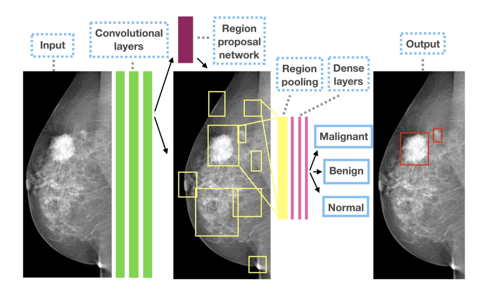

### frcnn\_cad 

* The original repository is available here: https://github.com/riblidezso/frcnn_cad
* The model operates on a single input mammogram. 
* It is based on Faster R-CNN. The model architecture is shown in the figure below.

