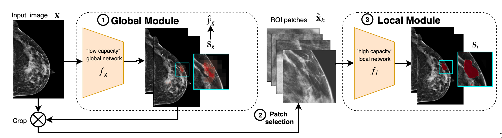

### NYU GLAM

* The original repository is available here: https://github.com/nyukat/GLAM 

In this work, the authors introduce a novel neural network architecture to perform weakly-supervised segmentation of high-resolution images. The proposed model selects regions of interest via coarse-level localization, and then performs fine-grained segmentation of those regions.

The inference pipeline of the model is shown below.

**Weakly-supervised High-resolution Segmentation**: Despite being trained with only image-level labels, GLAM is able to generate fine-grained pixel-level saliency maps (shown below) that provide interpretability for high-resolution images.

* There are 3 different hyper parameters in the config.txt file
    * `MODEL_NAME` - Name of the model to use. Valid values include {`model_joint`, `model_sep`}, the former one is the joint-trained model, the latter one is the model that trained without joint training.
    * `NUM_PROCESSES` - controls how many processes are used in the preprocessing of the images
    * `PREPROCESS_FLAG` - if set to True, forces the model to redo preprocessing even if it has already been completed. Otherwise, will use the preexisting preprocessed images.
