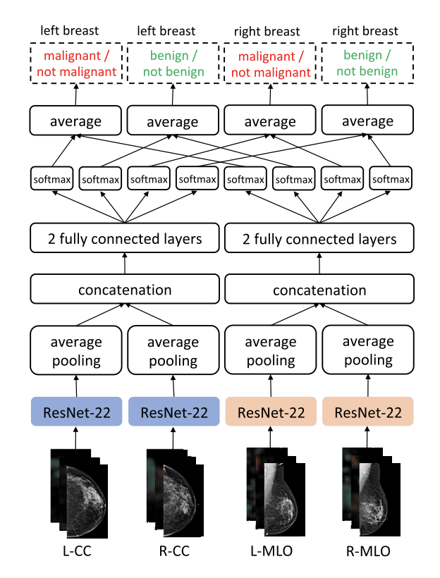

### NYU DMV-CNN

* The original repository is available here: https://github.com/nyukat/breast_cancer_classifier
* The model uses all 4 views typically found in a mammography exam: left craniocaudal (L-CC), right cranniocaudal (R-CC), left mediolateral oblique (L-MLO), right mediolateral oblique (R-MLO). It generates two sets of predictions, one for each breast. Each set of predictions has a probability that the breast contains a benign lesion and a probability that the breast contains a malignant lesion.
* The architecture of the model is shown in the figure below (https://ieeexplore.ieee.org/stamp/stamp.jsp?tp=&arnumber=8861376). Each of the views are fed through a ResNet-22 and average pooling layer to create a vector representation/embedding representation for each view. The two MLO embeddings are concatenated together and fed through two fully-connected layers and a softmax layer to generate predictions. The same thing happens to the CC embeddings. Finally, the predictions from the embeddings that correspond to the right breast are averaged together to get the final probabilities for right benign and right malignant, and the predictions from the embeddings that correspond to the left breast are averaged together to get the final probabilities for left benign and left malignant.

* There are 5 different hyper parameters that can be modified in the config.txt file:
  * `NUM_EPOCHS` - controls the number of epochs over validation set (with different preprocessing seeds) to be averaged in the output of the classifiers.
  * `NUM_PROCESSES` - controls how many processes are used in the preprocessing of the images.classifiers.
  * `HEATMAP_BATCH_SIZE` - controls the minibatch size used when generating heatmaps.
  * `PREPROCESS_FLAG` - if set to True, forces the model to redo preprocessing even if it has already been done; otherwise, uses the existing preprocessed images.
  * `USE_HEATMAPS` - controls whether to use heatmaps or not. If using heatmaps, the process consists of two steps: first a deep network is ran on all 256x256 patches from the main image to generate two heatmaps (one for malignancy, one for benignity). Then, a shallower network is used on the full resolution concatenation of the input image and two heatmaps. If not using heatmaps, the shallower network is used on the input images only.
* Note: This model expects all 4 views to be present in each exam. If your data does not have all 4 views present for each exam, consider using NYU Model Single, which is a similar model that operates on a single image.
